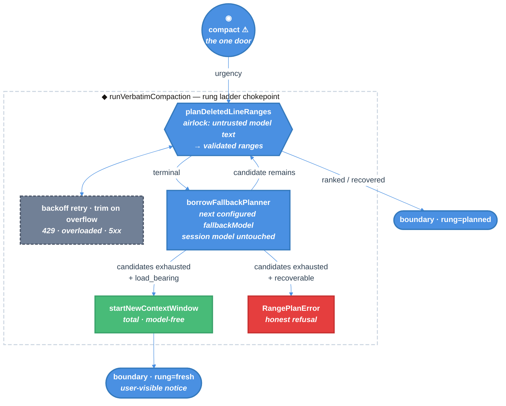

# Compaction Fallback Rungs — Technical Design Document / RFC

| Document Metadata      | Details |
| ---------------------- | ------- |
| Author(s)              | Norin Lavaee |
| Status                 | In Review (RFC) — all open questions resolved |
| Team / Owner           | `packages/coding-agent` — compaction |
| Created / Last Updated | 2026-07-27 |
| Research               | [`research/2026-07-27-compaction-reasoning-starvation-cross-harness.md`](../research/2026-07-27-compaction-reasoning-starvation-cross-harness.md) |
| Compatibility posture  | One scoped, documented SDK break (`runVerbatimCompaction`). Everything else preserved. See §10. |
| Design north star      | `openai/codex` compaction (`codex-rs/core/src/compact*.rs`), with verbatim line planning substituted for summary generation. |

---

## 1. Executive Summary

Atomic's Verbatim Compaction caps the planner request's output at
`0.8 × reserveTokens` (13,107 tokens) and forwards the live session reasoning level. On
every current reasoning model — `gpt-5.6-sol` and every adaptive-thinking Claude alike —
reasoning is drawn from that same cap, so a high-reasoning session can spend the whole
budget thinking and return no ranges. Compaction then hard-fails, and during a post-tool
preflight it kills the active turn. A rate limit that outlasts the retry budget does the
same thing.

Both the cap and the reasoning inheritance were copied from pi, which has the identical
defect but hides it behind an unvalidated prose summary. `openai/codex` avoids the class:
no output cap, backoff retry, input trimming, model fallback, and a model-free rung that
always completes.

This RFC ports codex's ladder, changing one thing: the model's job is **ranking lines for
verbatim deletion**, not writing a summary. Three rungs:

1. **`planned`** on the session model — verbatim line planning.
2. **`planned` on a fallback model** — reuses Atomic's configured `fallbackModels`,
   *borrowed* for the planner request without switching the session's model. This is the
   rung that rescues a rate-limited compaction with its quality intact.
3. **`fresh`** — `startNewContextWindow`, a total model-free rung porting codex's
   `compact_token_budget`.

Rungs 1-2 preserve compaction quality and run at any urgency. Only rung 3 destroys
context, so only it requires `load_bearing` urgency — leaving `/compact` free to fail
honestly.

---

## 2. Context and Motivation

### 2.1 Current State

One context-compaction door, `compact`, runs a single whole-region classifier request
through the session model and mechanically reconstructs the retained text. Two rungs
already exist in the persisted type — `compaction-types.ts:66` declares
`rung: "planned" | "extension"` — but only `"planned"` involves the planner;
`"extension"` is the `session_before_compact` override.

**The inherited cap** — `range-planner.ts:147-152`:

```ts
function outputTokenLimit(model: Model<Api>, reserveTokens: number): number {
	return Math.min(Math.floor(0.8 * reserveTokens), model.maxTokens > 0 ? model.maxTokens : Number.POSITIVE_INFINITY);
}
```

`reserveTokens` is an **input-side** reserve (`docs/compaction.md:390`). Reusing it as an
output cap is a conflation inherited verbatim from pi's `compaction.ts:637-639`. It is
not a provider requirement: codex sets no output cap at all (research §5.2).

**The inherited reasoning level** — `range-planner.ts:179` forwards `this.thinkingLevel`
straight from live session state. Codex does the same (`compact.rs:699`), so this is
**not** a defect on its own; it becomes one only in combination with the cap above,
which turns thinking tokens into a budget the deletion records then cannot fit in.
Removing the cap (§5.3) is what makes inheritance safe, exactly as it is for codex.

**Rate limits today.** `retryAssistantCall` already retries `429` / `rate limit` /
`too many requests` / `overloaded` / `5xx` with exponential backoff and fails fast on
quota/billing exhaustion (`pi-ai/dist/utils/retry.js`). That matches codex's
`backoff(attempt)` loop. What is missing is everything *after* the budget is spent: the
planner throws, compaction writes nothing, and a mid-turn preflight kills the turn.

**Model fallback exists but compaction is excluded from it.** `settings.fallbackModels`
is an ordered list of `provider/model[:thinkingLevel]` strings;
`agent-session-retry.ts:225-291` walks it on retryable errors. Its own source comment
(`:118`) records that quota/usage-limit exhaustion is deliberately classified retryable
*"so configured fallbackModels can advance to a provider/model with remaining headroom"*
— exactly the rate-limit case compaction currently cannot use.
`docs/compaction.md:99` states compaction "is not admitted to ordinary provider retry or
model fallback."

**Leaking doors today:**

- `outputTokenLimit(model, reserveTokens)` is named for its mechanism and promises a
  *token limit* while actually deciding *how much room reasoning may consume*.
- `planDeletedLineRanges` collapses six outcomes — ranked success, partial recovery,
  reasoning starvation, rate limiting, malformed output, overflow — into "ranges or
  throw". Callers cannot tell a throttle from garbage without string-matching an error.
- `runVerbatimCompaction` returns `CompactedTranscript & { rung: "planned" }`, narrower
  than the persisted union it feeds.

### 2.2 The Problem

- **User impact.** A high-reasoning session on a large context hits
  `Compaction range planning produced no usable deleted ranges`. During a post-tool
  preflight (`agent-session-tool-hooks.ts:103`) the active turn stops. Reported against
  an old prerelease; see PR #2048.
- **Rate limits.** A sustained 429 through the retry budget produces the same dead turn —
  while a perfectly good fallback model sits configured and unused.
- **Breadth.** Not OpenAI-specific. `claude-opus-5`, `claude-sonnet-5`,
  `claude-fable-5`, `claude-opus-4-6/4-7/4-8` and `claude-sonnet-4-6` all use adaptive
  thinking with categorical effort against one shared `max_tokens` pool and no output
  floor (research §3.2).

### 2.3 What we are explicitly *not* fixing by copying pi

pi never validates its summary and appends a deterministic file manifest, so a total
failure produces a plausible non-empty artifact and destroys context silently (research
§2.1). Atomic's strict validation is why this bug was reportable at all. **This RFC does
not soften that check.**

---

## 3. Goals and Non-Goals

### 3.1 Functional Goals

- [ ] Reasoning tokens can never *fail* a compaction. Starvation may still occur — codex
      lives with the same exposure and simply accepts the empty result — but it must
      always be absorbed by model borrowing, then the fresh rung.
- [ ] A rate-limited or failing session model does not cost compaction quality when a
      usable fallback model is configured.
- [ ] A load-bearing compaction (overflow recovery, post-tool preflight) always
      completes.
- [ ] Rate limiting, quota exhaustion, overflow, and reasoning starvation are distinct
      typed outcomes, separable in code, diagnostics, and UI.
- [ ] Every retained line stays byte-identical to an input line on every rung.
- [ ] Borrowing a fallback model for compaction never mutates the session's model,
      thinking level, or persisted model history.
- [ ] Reaching the context-destroying rung is visible to the user and recorded durably.

### 3.2 Non-Goals (Out of Scope)

- [ ] We will **NOT** introduce a server-side/remote compaction path. Codex's
      `responses/compact` has no Atomic equivalent.
- [ ] We will **NOT** fabricate, rewrite, summarize, or reorder retained text on any
      rung.
- [ ] We will **NOT** relax the zero-usable-ranges rejection.
- [ ] We will **NOT** let manual `/compact` reach the context-destroying rung.
- [ ] We will **NOT** reuse `_trySwitchToFallbackModel`. It is main-chat turn machinery:
      it mutates `agent.state.model`, appends a model-change entry, changes the session
      thinking level, refreshes the system prompt, emits `model_changed`/`model_select`,
      and calls `agent.continue()`. A compaction sub-request must do none of those.
- [ ] We will **NOT** change `reserveTokens` semantics, defaults, or the threshold.
- [ ] We will **NOT** patch `node_modules` or vendor `@earendil-works/pi-ai`.

---

## 4. Proposed Solution (High-Level Design)

### 4.1 System Architecture Diagram



### 4.2 Architectural Pattern

**Graceful-degradation ladder with a total terminal rung**, ported from codex's
`tasks/compact.rs` dispatch, `compact_model_fallback.rs`, and `compact_token_budget.rs`.
The organising principle:

> **Rungs that preserve quality run at any urgency. Only the rung that destroys context
> requires `load_bearing`.**

Model fallback is *substitution*, not degradation — a different model produces an equally
valid ranking — so it is always allowed. Starting a fresh window is destruction, so it is
gated.

### 4.3 Codex Correspondence

Every element traces to a codex mechanism. The only substitution is the model's job.

| Codex | Atomic | Note |
| --- | --- | --- |
| No `max_output_tokens` in `ResponsesApiRequest` (`codex-api/src/common.rs:252`) | `PlannerBudget.maxTokens = undefined` | pi-ai's context clamp becomes the only bound |
| `backoff(attempt)` loop, `stream_max_retries` | existing `retryAssistantCall` + `settings.retry` | already covers 429/overload; quota fails fast |
| `history.remove_first_item()` on `ContextWindowExceeded` | trim oldest region lines, retry | §5.3 |
| `compact_model_fallback.rs` — retry compaction on another model for `UsageLimitReached`, `ServerOverloaded`, `InvalidRequest`, `UnexpectedStatus`, `ContextWindowExceeded`, `InternalServerError`, `RetryLimit` | **`borrowFallbackPlanner`** over `settings.fallbackModels` | codex switches previous→current model; Atomic walks the user's configured list |
| `compact_token_budget` → `start_new_context_window` | **`startNewContextWindow`** | the terminal rung |
| `"(no summary available)"` placeholder (`compact.rs:670`) | typed outcomes + explicit marker | Atomic can be stricter: it validates |
| `CodexCompactionEvent` telemetry | existing `0600` diagnostic sidecar + `rung` on `compaction_end` | Atomic's per-failure evidence is finer-grained |
| Local summarization (`SUMMARIZATION_PROMPT`) | **verbatim line planning** | ← the one intentional difference |
| Inherits session `reasoning_effort` for compaction (`compact.rs:699`) | inherits session `thinkingLevel` | safe once the cap is gone (§9.1 Q4) |
| `responses/compact` remote endpoint | *(none)* | no Atomic equivalent |

### 4.4 The Door Set at a Glance (Stranger-Across-Time View)

`compact` ⚠ · `planDeletedLineRanges` · `borrowFallbackPlanner` · `startNewContextWindow` ⚠ · `runVerbatimCompaction` ⚠

Read alone: there is one way to compact context; the model's contribution is *ranking*,
and it arrives through a single airlock; if the session's model cannot rank, another
configured model may be borrowed for that one request; if none can, the system can still
start a fresh context window without a model, and that is a deliberately-named
irreversible act; one chokepoint decides which happened.

---

## 5. Detailed Design

### 5.1 The Doors (Entrypoint Contracts)

```ts
// ─── Types that make the illegal unrepresentable ──────────────────────────────

/** How much the caller can afford to lose if compaction does not happen. */
type CompactionUrgency =
  | "recoverable"    // manual /compact, threshold auto-compaction — failing is safe
  | "load_bearing";  // overflow recovery, post-tool preflight — failing kills the turn

/** How a durable boundary was produced. Widens the existing persisted union. */
type CompactionRung = "planned" | "extension" | "fresh";

/** Every way one planner attempt can end. No stringly-typed failure classification. */
type PlannerOutcome =
  | { kind: "ranked";        ranges: RawLineRange[] }
  | { kind: "recovered";     ranges: RawLineRange[]; recoveredCount: number }
  | { kind: "rateLimited";   exhausted: boolean; message: string; diagnosticPath?: string }
  | { kind: "unusable";      category: DiagnosticFailureCategory; excerpt: string; diagnosticPath?: string }
  | { kind: "overflowed";    diagnosticPath?: string }
  | { kind: "providerError"; message: string; diagnosticPath?: string };
// "cancelled" is NOT a variant: abort throws, as today.
// `rateLimited.exhausted` separates "retry budget spent" from non-retryable
// quota/billing exhaustion, which never spends backoff.
// Reasoning starvation is NOT a variant. Codex has no starvation concept — a
// reasoning-only response is not an error there, it flows through to the
// "(no summary available)" placeholder (compact.rs:349,670). Atomic validates, so it
// cannot accept the empty plan, but it likewise does not branch on it: starvation is
// an `unusable` outcome carrying a `starved` DiagnosticFailureCategory for the sidecar,
// and advances the ladder exactly like any other unusable output.

/** A planner-only model borrowing. Cannot be confused with a session model switch. */
interface BorrowedPlanner {
  readonly model: Model<Api>;
  readonly budget: PlannerBudget;
  readonly auth: { apiKey?: string; headers?: ProviderHeaders; baseUrl?: string };
}

/** What one planner request may spend. Cap and effort stay fused (§9.1 Q3). */
interface PlannerBudget {
  readonly maxTokens: undefined;       // ← literally `undefined`, not a number.
                                       //   The type forbids reintroducing a cap.
  readonly reasoning: ThinkingLevel | undefined;
}

resolvePlannerRequest(
  model: Model<Api>,
  sessionThinkingLevel: ThinkingLevel | undefined,   // inherited — codex parity (§9.1 Q4)
  candidateThinkingLevel?: ThinkingLevel,            // from a `model:level` fallback entry
): PlannerBudget
// Guarantee: returns what this planner attempt may spend.
// The structural protection lives in the TYPE, not in the argument list: `maxTokens` is
// declared `undefined`, so no future edit can reintroduce `0.8 * reserveTokens` without
// changing the type and failing review. Inheriting the session level is safe for the same
// reason it is safe in codex: there is no artificial budget for thinking to exhaust.
// Precedence: candidateThinkingLevel ?? sessionThinkingLevel. There is no per-attempt
// variation — codex never modifies reasoning effort across compaction attempts
// (compact.rs:699, compact_remote_v2.rs:349 are the only two occurrences, both
// unmodified clones), so neither does Atomic.


// ─── Door 1: the ranked planner (the airlock) ─────────────────────────────────

planDeletedLineRanges(
  region: NumberedRegion,
  parameters: VerbatimCompactionParameters,
  planner: BorrowedPlanner,            // ← model + budget + auth travel together
  targetKeepLines: number,
  options: RangePlannerOptions & { signal?: AbortSignal },
): Promise<PlannerOutcome>
// Guarantee: classifies one whole-region planner attempt into exactly one PlannerOutcome.
// Never throws except on cancellation. Never returns unvalidated ranges.
// This is the single place untrusted model text becomes trusted line numbers.


// ─── Door 2: borrow another configured model for one planner request ──────────

borrowFallbackPlanner(
  attempted: ReadonlySet<string>,      // provider/model:level keys already tried
  resolveAuth: (model: Model<Api>) => Promise<PlannerAuth | undefined>,
): Promise<BorrowedPlanner | undefined>
// Guarantee: returns the next configured fallback model usable for one planner request.
// Returns undefined when the configured list is exhausted — that is the ONLY exit; it
// never throws and never falls back to the session model.
//
// Refusals, and why they are structural rather than remembered:
//   • Returns a BorrowedPlanner, a value. It holds no session handle, so it CANNOT
//     mutate agent.state.model, append a model-change entry, change the session
//     thinking level, or call agent.continue(). Contrast _trySwitchToFallbackModel
//     (agent-session-retry.ts:257-286), which does all four.
//   • `attempted` is passed in and owned by the compaction run, so borrowing never
//     touches the main chat's _fallbackAttemptedKeys.
//   • Candidate resolution reuses the existing resolveFallbackModel semantics, which
//     already filter on _modelRegistry.hasConfiguredAuth (agent-session-retry.ts:39),
//     so an unusable candidate is never returned.


// ─── Door 3: the terminal rung ────────────────────────────────────────────────

startNewContextWindow(
  preparation: VerbatimCompactionPreparation,
): CompactedTranscript
// Guarantee: discards every compactable line and starts a fresh context window.
// TOTAL. No provider, no credentials, no network, no signal, no failure mode,
// no `Promise`. Its type says it cannot fail; that is the point.
// Port of codex `compact_token_budget` → `Session::start_new_context_window`
// (session/mod.rs:3609), which replaces history with regenerated standing context
// and an empty summary message.
// Atomic analogue: system prompt, context files, and skills are rebuilt per request
// and were never in the transcript, so they survive automatically — they ARE Atomic's
// `build_initial_context_with_world_state`. This door discards the compactable region
// and any prior durable summary.
//
// It takes NO hard-input-limit argument. An earlier draft gave it one, but the limit
// decides only whether the protected tail survives (§9.1 Q12), and that decision is a
// persistence concern carried on `CompactionRungResult.keptTail` — it is not observable
// in the returned `CompactedTranscript`. A parameter that cannot affect this door's
// result would be a boundary lie (principle 2). The runner applies the limit internally
// when it builds the rung result.


// ─── Door 4: the rung chokepoint ──────────────────────────────────────────────

runVerbatimCompaction(
  preparation: VerbatimCompactionPreparation,
  model: Model<Api>,
  request: {
    resolveAuth: (model: Model<Api>) => Promise<PlannerAuth | undefined>;
    signal?: AbortSignal;
    thinkingLevel: ThinkingLevel | undefined;   // inherited by the planner (§9.1 Q4)
    urgency: CompactionUrgency;        // ← required; no default
  } & CompactionPlanOptions,
): Promise<CompactionRungResult>
// Guarantee: produces one compacted transcript, tagged with the rung that produced it.
// Refusal expressed in the type: `startNewContextWindow` is unreachable unless
// `urgency === "load_bearing"`. A manual /compact literally cannot construct the
// argument that would let it destroy context.
//
// ⚠ BREAKING — §9.1 Q6. Published SDK export (`src/index.ts:102`). Positional
// positional apiKey/headers/signal/thinkingLevel/options collapse into one request
// object, and
// pre-resolved credentials become a `resolveAuth(model)` callback because a borrowed
// fallback model needs its OWN credentials, not the session model's. The existing
// call site already passes `options.resolvePlannerAuth()`
// (agent-session-compaction.ts:110), so this is a small change there.
```

**Per-door audit (rubric):**

| Door | (1) Joint | (2) One sentence, no "and" | (3) Honest name | (5) Every exit | (6) Refusals real | (7) Trust transition | (8) One chokepoint |
| --- | --- | --- | --- | --- | --- | --- | --- |
| `planDeletedLineRanges` | ✅ "plan what to delete" | ✅ "classifies one attempt into one outcome" | ✅ *plans*, does not apply | length→`starved`/`recovered`; 429→`rateLimited`; overflow→`overflowed`; abort→throws | unvalidated ranges unreturnable (type) | ✅ **the** model-text airlock | ✅ sole model call |
| `borrowFallbackPlanner` | ✅ "borrow a model" | ✅ "returns the next usable configured fallback" | ✅ *borrow*, not *switch* | exhaustion→`undefined`; never throws | session mutation unrepresentable (returns a value, holds no session) | n/a | ✅ sole planner-model source |
| `startNewContextWindow` ⚠ | ✅ codex's own domain verb | ✅ "starts a fresh context window" | ✅ says *fresh*, not *compacted* | no error/timeout/partial exits exist | totality is the type | n/a | ✅ sole model-free producer |
| `runVerbatimCompaction` ⚠ | ✅ "compact this region" | ✅ "produces one transcript tagged with its rung" | ✅ | every rung tagged; abort propagates | destruction needs `load_bearing` (type) | n/a | ✅ sole rung selector |

### 5.2 Data Model / Schema

`compaction-types.ts:66` already declares `rung: "planned" | "extension"`. It gains one
member:

| `details.rung` | Meaning | Model call | User-visible |
| --- | --- | --- | --- |
| `"planned"` | A model ranked the lines — session model **or** a borrowed fallback. Includes silent partial recovery. | yes | no (unchanged) |
| `"extension"` | `session_before_compact` override (existing, unchanged) | no | no |
| `"fresh"` | Compactable conversation discarded; new context window started | no | **yes** |

**A borrowed-fallback success is `"planned"`, not a separate rung.** The rung records
*how the deletions were chosen*, and they were chosen by ranking. Which model ranked them
is recorded in `details` (§5.3) and diagnostics, not in the rung. Inventing a
`"planned-fallback"` rung would make every consumer switch on two values that mean the
same thing.

No new entry type, no format-version bump. `details.stats` gains no fields.

### 5.3 Algorithms and State Management

**The ladder** (inside `runVerbatimCompaction`):

```
attempted := {}
planner   := session model, resolvePlannerRequest(model, sessionThinkingLevel)
loop:
  outcome := planDeletedLineRanges(region, params, planner, ...)
      ── inside: retryAssistantCall applies settings.retry backoff to
         429 / rate limit / overloaded / 5xx; quota/billing returns immediately
  case ranked | recovered      → validate, reconstruct, rung="planned". DONE.
  case overflowed (region > 1 line, trims left)
                               → drop oldest region lines; continue   // codex parity
  case terminal                → attempted += key(planner.model)
                                 next := borrowFallbackPlanner(attempted, resolveAuth)
                                 if next: planner := next; continue
                                 if urgency == "load_bearing":
                                     startNewContextWindow(prep); tail per hardInputLimit
                                     rung="fresh"; notice. DONE.
                                 throw RangePlanError                 // recoverable
```

Terminal outcomes that advance to the next model: `rateLimited` (either kind),
`providerError`, `unusable` (including the `starved` category), and `overflowed` with
trimming exhausted. This set mirrors codex's `should_retry_with_current_model`
(`compact_model_fallback.rs:8-20`), which likewise includes `InvalidRequest` and
`UnexpectedStatus` — a model that keeps emitting malformed records is a model-specific
failure, and another model may well succeed.

`overflowed` deserves note: a fallback model with a larger context window can succeed
where the session model could not, so advancing is genuinely useful and not just a
formality.

**Borrowing rules.** Each candidate gets its own fresh starvation-retry allowance and its
own `resolvePlannerRequest` budget, and is tried at most once per compaction run
(`attempted` is keyed `provider/model:thinkingLevel`, matching
`agent-session-retry.ts:43`). The list is walked once, in configured order; it is
user-authored and finite, so no extra bound is imposed. `settings.retry` still governs
transport attempts *within* each candidate.

**What borrowing must not do** — the whole point of the `BorrowedPlanner` value type:
no `agent.state.model` write, no `sessionManager.appendModelChange`, no session
thinking-level change, no system-prompt refresh, no `model_changed`/`model_select`, no
`agent.continue()`, and no writes to the main chat's `_fallbackAttemptedKeys`. After
compaction returns, `session.model` is exactly what it was before.

**Budget resolution** (`resolvePlannerRequest`):

- `maxTokens`: always `undefined`. No cap is sent. `buildBaseOptions` already clamps every
  provider to `contextWindow − estimatedInput − 4096` (`simple-options.js:10-19`), so the
  context window remains the real bound — codex's posture.
- `reasoning`: the session `thinkingLevel`, inherited and never modified across attempts —
  codex parity (§9.1 Q4, §9.3). A borrowed candidate's own `:thinkingLevel` suffix, when
  present in the `fallbackModels` entry, takes precedence over the inherited level.

**Starvation, as a diagnostic category only** (inside `planDeletedLineRanges`):

```ts
stopReason === "length" && recoveredRanges.length === 0 && (usage.reasoning ?? 0) > 0
  ⇒ { kind: "unusable", category: "starved", ... }
```

`Usage.reasoning` is a documented subset of `output` (`pi-ai/dist/types.d.ts:251-264`).
This changes no control flow — a `starved` outcome advances the ladder exactly like any
other `unusable` output. It exists so the `0600` sidecar can say *why* the plan was empty,
which is what made the original report diagnosable. A length stop with usable partial
ranges still succeeds silently as today.

**Rate-limit classification**, using the same patterns pi-ai uses so the outcome is typed
rather than string-matched downstream:

| Condition | Outcome | Backoff spent | Advances model |
| --- | --- | --- | --- |
| `429` / `rate limit` / `too many requests` / `overloaded` / `5xx`, retries exhausted | `rateLimited { exhausted: true }` | yes | yes |
| `insufficient_quota` / `billing` / `quota exceeded` / `available balance` | `rateLimited { exhausted: false }` | no | yes |
| context overflow (`isContextOverflow`) | `overflowed` | n/a | after trimming |
| other provider error | `providerError` | per policy | yes |

**The terminal rung** (`startNewContextWindow`): emit the whole compactable region as one
deletion range and hand it to the unchanged `validateDeletedRanges` →
`reconstructCompactedTranscript` path, which splits around protected spans and folds
prior markers. No new reconstruction code, which is what keeps the verbatim guarantee
free.

What survives:

| Content | Fate | Codex analogue |
| --- | --- | --- |
| System prompt, context files, skills | untouched — never in the transcript | `build_initial_context_with_world_state` |
| Explicit protected spans | kept (hard floor, unchanged) | — |
| `preserve_recent` protected tail | kept **unless** the tail alone still exceeds `hardInputLimit` | codex keeps none; §9.1 Q12 |
| Compactable region + prior durable summary | discarded, one marker | `replace_compacted_history(..., message: String::new())` |

The tail exception exists because the kept tail is serialized **losslessly** — tool
results keep full text rather than the region's 16k cap (`docs/compaction.md:65`) — so a
single huge tool result can exceed the window by itself. Without the exception the fresh
rung would complete while `agent-session-post-tool-compaction.ts:97` still refuses the
follow-up, making the guarantee hollow at precisely the moment it matters. `preserve_recent`
is honored whenever it fits and abandoned only when honoring it would guarantee failure.

**Scope of the guarantee.** The ladder guarantees *compaction* completes. It does not
guarantee the *turn* succeeds: if every configured model is rate limited, the follow-up
request will be too. What it buys is that Atomic does not additionally destroy the turn
with a compaction failure, that a healthy fallback model rescues quality when one exists,
and that the retry starts from a small context. Codex has the same property.

**Urgency assignment at call sites:**

| Call site | Urgency | Can borrow a model | Can start a fresh window |
| --- | --- | --- | --- |
| `/compact`, `ctx.compact()`, `session.compact()`, RPC `compact` | `recoverable` | ✅ | ❌ |
| Threshold auto-compaction | `recoverable` (§9.1 Q2) | ✅ | ❌ |
| Overflow recovery | `load_bearing` | ✅ | ✅ |
| Post-tool preflight (`_preflightPostToolContext`) | `load_bearing` | ✅ | ✅ |

### 5.4 User-Visible Behavior

**Borrowing is quiet.** A compaction that succeeds on a fallback model is an ordinary
success: normal spinner, `✻ Context compacted`, `rung: "planned"`. The borrowed model is
recorded in `details` and the diagnostic sidecar for anyone who looks. Rationale: the
result is quality-equivalent, the session model did not change, and a banner would train
users to ignore banners. `compaction_end` **does** carry the borrowed model so extensions
and attached workflow stage chat can surface it if they choose (§9.1 Q13).

**The fresh rung is loud.** It replaces `✻ Context compacted` with
`✻ Context cleared (compaction degraded)` (§9.1 Q5 — one generic line; the precise cause
is in the `0600` sidecar). `compaction_end` carries the rung so attached workflow stage
chat renders the same. Extension `session_compact` observers already receive
`event.result.rung` (`docs/compaction.md:190`) and now observe a third value.

### 5.5 Branch Summarization

`branch-summarization.ts:309` carries the same `16384` default and the same session
reasoning inheritance. It adopts `resolvePlannerRequest` and the cap removal (§9.1 Q8).
It gets **no rung ladder and no model borrowing**: branch summarization is opt-in, off
the critical path, and already documented as intentionally lossy
(`docs/compaction.md:204`). Its failure remains a clean error.

---

## 6. Alternatives Considered

| Option | Pros | Cons | Reason for Rejection |
| --- | --- | --- | --- |
| **A. PR #2048 as written** — cap reasoning at `low`, retry once at `minimal` | Small; already reviewed | `low` is a constant, not a bound; retries on any length stop; leaves the invented cap in place; still hard-fails mid-turn; no rate-limit or fallback path | Treats the symptom. Superseded entirely: with the cap removed, capping reasoning is unnecessary (§9.1 Q4), and its retry trigger is replaced by the narrower starvation fingerprint. |
| **B. Port `adjustMaxTokensForThinking` to all providers** | Mirrors the Anthropic path | The addition is clamped away near the limit; the real protection is a numeric `budget_tokens` floor OpenAI and adaptive Claude cannot express (research §3.1-3.2) | Ports the ineffective half. |
| **C. Fix upstream in pi-ai only** | Fixes pi's silent bug too | pi auto-closes new-contributor issues (#6001 unfixed since 0.79.10); users blocked now | Deferred, §9.1 Q7. |
| **D. Unranked deletion rung** — delete every unprotected line as the fallback | Gentler than a fresh window | Diverges from codex for no guarantee gain; outcome nearly identical to a fresh window; a third rung to test | Rejected for codex fidelity. |
| **E. Reuse `_trySwitchToFallbackModel`** | No new code | Mutates session model, appends model-change history, changes thinking level, emits `model_changed`, calls `agent.continue()` — a user's session model would silently change because compaction was throttled | Rejected; §3.2. Borrowing is a separate, weaker capability. |
| **F. Model fallback gated on `load_bearing`** | Fewer moving parts for `/compact` | Model substitution is not degradation; refusing it would fail a manual `/compact` that a configured fallback could have served | Rejected: gate destruction, not substitution. |
| **G. Selected: no cap + decoupled budget + trimming + borrowed model fallback + urgency-gated fresh window** | Removes the cause; survives rate limits with quality intact; codex-faithful; keeps verbatim and honest failure where safe | Three rungs to test; one SDK break | **Selected.** |

---

## 7. Cross-Cutting Concerns

### 7.1 Security and Privacy

- **Trust transition is singular.** Untrusted model text becomes trusted line numbers at
  `planDeletedLineRanges` and nowhere else — including for borrowed models, which reuse
  the same door (rubric #7).
- **Credentials are resolved per model.** `resolveAuth(model)` means a borrowed candidate
  uses its own provider credentials; the session model's key is never sent to another
  provider. `resolveFallbackModel` already refuses candidates without configured auth
  (`agent-session-retry.ts:39`).
- **Transcript exposure.** Borrowing sends the compactable transcript to a *different
  provider* than the user selected. Candidates come only from the user's own
  `fallbackModels`, so the set is user-authored — but this is a real data-flow change and
  §9.1 Q14 resolves this by reusing the user's own `fallbackModels` rather than adding an
  opt-in, so the docs must state plainly that a configured fallback model may receive the
  compaction transcript.
- **Irreversible effects pass one chokepoint.** All rungs converge on the existing
  `reconstructCompactedTranscript` → `appendCompaction` path (rubric #8).
- **Diagnostics.** The `0600` sidecar gains `starved` and `rate_limited` categories,
  `usage.reasoning`, and the borrowed model identity. Existing exclusions — no API keys,
  headers, planner prompt, or numbered transcript — are unchanged.
- **No new credential surface in the terminal rung.** `startNewContextWindow` takes no auth.

### 7.2 Documentation

`docs/compaction.md:99` states: *"There is no semantic retry, critical rung, deterministic
fallback, or deterministic target correction"* and that compaction *"is not admitted to
ordinary provider retry or model fallback."* Both become false. That paragraph, the
`details.rung` example at `:154`, the persistence section, the failure-behavior section,
and the settings table all require amendment in the same change.

### 7.3 Changelog

`packages/coding-agent/CHANGELOG.md` under `## [Unreleased]`: `### Breaking Changes`
(the `runVerbatimCompaction` signature), `### Fixed` (reasoning starvation),
`### Added` (fallback-model borrowing, fresh-window rung, rate-limit survival). PR
#2048's entry is superseded and should be replaced, not appended to.

---

## 8. Test Plan

- **Unit — budget:** `resolvePlannerRequest` returns `undefined` maxTokens (assert at the
  type level too, since `PlannerBudget.maxTokens` is declared `undefined`), inherits the
  session level, prefers a candidate's `model:level` suffix over the inherited level, and
  is identical on every attempt for a given model.
- **Unit — outcome classification:** every `PlannerOutcome` variant from a synthetic
  response. `length` + empty + `usage.reasoning > 0` ⇒ `unusable { category: "starved" }`;
  `length` + empty + `usage.reasoning === 0` ⇒ `unusable` with a different category;
  valid records ⇒ `recovered` (**no retry**, silent); `429` after exhausted retries ⇒
  `rateLimited { exhausted: true }`; `insufficient_quota` ⇒ `rateLimited { exhausted:
  false }` with **zero** backoff sleeps observed.
- **Unit — borrowing purity (the load-bearing test):** after a compaction that succeeds on
  a fallback model, assert `session.model`, `session.thinkingLevel`, the session entry
  list, and `_fallbackAttemptedKeys` are all **byte-identical to before**, and that no
  `model_changed`, `model_select`, `model_fallback_start` or `agent.continue()` occurred.
- **Unit — borrowing order and exhaustion:** candidates tried in configured order, each at
  most once, keyed by `provider/model:level`; candidates without configured auth skipped;
  exhaustion returns `undefined` rather than throwing.
- **Unit — per-candidate auth:** `resolveAuth` is called once per candidate with that
  candidate's model; the session model's `apiKey` never appears in a borrowed request.
- **Unit — totality:** `startNewContextWindow` on empty, all-protected, single-line, and
  non-contiguous-protected regions. Property test: every retained non-marker line is
  byte-identical to an input line and in input order.
- **Unit — tail exception:** tail under the limit ⇒ tail kept; tail alone over the limit ⇒
  tail dropped, and the result is under `hardInputLimit`.
- **Unit — refusal:** `recoverable` urgency cannot reach the fresh rung (assert by
  construction plus a runtime test that a manual-path exhaustion still throws), but *can*
  borrow a model.
- **Integration — rate-limit rescue:** session model returns `429` on every attempt, a
  healthy fallback is configured ⇒ boundary written with `rung: "planned"`, **no** notice,
  `session.model` unchanged, turn completes.
- **Integration — rate-limit exhaustion:** every configured model returns `429` in a
  post-tool preflight ⇒ `rung: "fresh"`, notice shown, exactly one follow-up provider
  request, `agent.continue()` not called.
- **Integration — starvation:** a starved response on the session model then a healthy
  fallback ⇒ exactly **two** planner requests, both at the inherited reasoning level,
  `rung: "planned"`.
- **Integration — overflow trimming then fallback:** overflow that trimming cannot fix ⇒
  advances to a larger-context fallback ⇒ `rung: "planned"`.
- **Integration — manual honesty:** `/compact` with every model rate limited ⇒ no
  boundary, `compaction_end` reports failure with a diagnostic path, session usable.
- **Regression — cap removal:** the planner request carries no `maxTokens`.
- **Interactive verification:**
  1. `bun install` in the worktree, then
     `bun run test:unit && bun run test:integration && bun run typecheck && bun run check:file-length`.
  2. Configure `fallbackModels`, stub the session model to return `429` on every call,
     trigger a post-tool preflight. **Expect:** turn completes, JSONL shows
     `rung: "planned"` with the fallback model recorded in `details`, and `/model` still
     reports the original session model.
  3. Stub *every* configured model to `429`. **Expect:** `rung: "fresh"` and
     `✻ Context cleared (compaction degraded)`; manual `/compact` under the same stub
     fails with a `rate_limited` diagnostic and writes no boundary.

---

## 9. Decisions and Open Questions

### 9.1 Resolved

- [x] **Q1 — Output cap → no cap.** pi-ai's `clampMaxTokensToContext` becomes the only
      bound, which is codex's posture. Accepted risk: a pathological model could emit one
      record per line (~8 tokens/line) — a cost regression, not a correctness one.
- [x] **Q2 — Threshold auto-compaction → `recoverable`.** The turn boundary has passed, so
      failure is survivable. It may still borrow a fallback model.
- [x] **Q5 — Notice wording → one generic line.** `✻ Context cleared (compaction
      degraded)`; the precise cause lives in the diagnostic sidecar.
- [x] **Q6 — `runVerbatimCompaction` → options object, documented breaking change.**
      `thinkingLevel` handling follows Q4; pre-resolved credentials become
      `resolveAuth(model)` regardless, because borrowing requires per-model credentials.
- [x] **Q7 — Upstream pi-ai report → not now.** Revisit once the Atomic fix has shipped
      and produced real evidence.
- [x] **Q8 — `branch-summarization.ts` → folded in** for the budget fix only; no ladder,
      no borrowing (§5.5).
- [x] **Q9 — Fresh rung keeps the `preserve_recent` tail**, subject to Q12.
- [x] **Q10 — Terminal rung → codex's fresh context window**, replacing the earlier
      unranked-deletion design (§6 option D).
- [x] **Q11 — Rate limits → ladder, not a special case.** Existing `retryAssistantCall`
      backoff is reused unchanged; exhaustion becomes a typed `rateLimited` outcome that
      advances to the next configured model, then to the fresh rung.
- [x] **Q12 — Tail dropped only when keeping it guarantees failure.** §5.3.
- [x] **Q3 — `PlannerBudget` stays fused.** Internal taste with no user-visible effect;
      splitting re-opens the "cap without effort" hole.

- [x] **Q4 — Planner reasoning → inherited from the session, codex parity.** Codex does
      the same at `compact.rs:699`. With the cap removed, inheritance is safe for the same
      reason it is safe for codex: there is no artificial budget for thinking to exhaust.
      Starvation is accepted rather than retried, exactly as codex accepts its empty
      summary, and is absorbed by model borrowing and then the fresh rung.
      No new setting; `thinkingLevel` keeps its meaning and stays in the
      `runVerbatimCompaction` request object, so the Q6 break is confined to collapsing
      positional arguments and the credential resolver.
- [x] **Q16 — No starvation retry.** Codex modifies reasoning effort on no compaction
      attempt: `reasoning_effort` occurs exactly twice in its compaction code
      (`compact.rs:699`, `compact_remote_v2.rs:349`), both unmodified clones, and its
      retry loop fires only on `Err(e)` with backoff at the same effort. A reasoning-only
      response is not an error there at all. An earlier draft of this spec added an
      Atomic-invented `"off"` retry; it is removed. Starvation is one more `unusable`
      outcome that advances the ladder.
- [x] **Q13 — `compaction_end` carries the borrowed model; the default UI stays quiet.**
      Extensions and attached workflow stage chat can surface it; the main chat does not,
      because the result is quality-equivalent and a banner on an ordinary success trains
      users to ignore banners.
- [x] **Q14 — Borrowing reuses `settings.fallbackModels` as-is.** The list is already
      user-authored, and `sdk-types.ts:30` documents it as main-chat-scoped, so widening
      its scope is a documented behavior change either way. No new configuration key. The
      docs and changelog must state plainly that a configured fallback model may receive
      the compaction transcript.
- [x] **Q15 — Ships as one change.** Docs, changelog and the breaking signature are
      written once and the ladder is reviewed and tested as a whole, rather than landing
      the budget fix first and revisiting every surface a second time.

### 9.2 Still open

*None. All questions resolved; status moved to In Review (RFC).*

### 9.3 Divergences from codex (the complete list)

Everything else in this design traces to a codex mechanism (§4.3). These are the only
places Atomic deliberately differs, and each needs a reason that survives review:

| # | Divergence | Why |
| --- | --- | --- |
| 1 | **Verbatim line planning instead of summary generation** | The whole point of Verbatim Compaction; retained text is never rewritten. |
| 2 | **Empty plans are rejected, not accepted** | Codex accepts a starved result and writes `"(no summary available)"`. Atomic validates, so it has no equivalent placeholder — an empty plan deletes nothing and is not a compaction. This is the property that made the original bug reportable and is not up for negotiation (§2.3). |
| 3 | **`CompactionUrgency` gates the fresh rung** | Codex gates its `compact_token_budget` rung on a feature flag applied to manual and auto alike. Atomic has a mid-turn post-tool preflight that codex lacks, where failure kills an active turn, and a manual `/compact` where it does not. The gate distinguishes them so `/compact` fails honestly instead of clearing context. |
| 4 | **Fresh rung keeps the `preserve_recent` tail** | Codex keeps no conversation. `preserve_recent` is a documented Atomic setting; it is honored whenever it fits and dropped only when keeping it would guarantee a hard-limit failure (§9.1 Q12). |
| 5 | **Borrowing walks `settings.fallbackModels`** | Codex switches previous→current model under `ModelDownshift`; Atomic has no such split, so the user's configured list is the nearest equivalent (§9.1 Q14). |

Divergence 3 is the one a reviewer should push hardest on: it is the only one that adds a
type and a parameter rather than removing something. If the mid-turn preflight argument
does not hold, urgency should collapse into a setting and the ladder simplifies.

## 10. Backwards Compatibility

**Posture: one scoped, documented SDK break. Everything else preserved.**

| Surface | Status |
| --- | --- |
| `compaction.*` settings and defaults | **Preserved.** `reserveTokens` keeps its meaning and `16384` default. No new keys. |
| `settings.fallbackModels` | **Semantics widened.** Documented as main-chat-scoped (`sdk-types.ts:30`); compaction now borrows from the same list (§9.1 Q14). Requires a docs and changelog note. |
| Persisted `CompactionEntry` shape | **Preserved, additively.** No format-version bump and no new entry type. `details.rung` widens from two values to three, and `details` gains one optional field recording the borrowed planner model when one was used. Absent on every existing entry and on any compaction that used the session model, so old readers are unaffected. |
| Existing sessions on resume | **Preserved.** Resume never reruns planning (`docs/compaction.md:162`). |
| `session_before_compact` / `session_compact` events | **Preserved, additively.** `event.result.rung` gains a third value, and `compaction_end` gains an optional borrowed-model field (§9.1 Q13). |
| Extension `compactedText` override | **Preserved.** Still produces `rung: "extension"`, still needs no credentials. |
| `settings.retry` behavior | **Preserved.** Same policy, backoff, and non-retryable set. |
| Session model / thinking level after compaction | **Preserved by design and by test.** Borrowing never mutates them. |
| `runVerbatimCompaction` (SDK export) | **BREAKING.** Positional args collapse into one request object; pre-resolved `apiKey`/`headers` become `resolveAuth(model)`. |
| `planDeletedLineRanges` | Internal — not exported from `src/index.ts`. Signature and return type both change. |

**Migration for the one break:**

```ts
// before
await runVerbatimCompaction(prep, model, apiKey, headers, signal, thinkingLevel, options);

// after — credentials become a per-model resolver so a borrowed fallback
// model can use its own; the caller already has one to hand.
await runVerbatimCompaction(prep, model, {
  resolveAuth: options.resolvePlannerAuth,
  signal,
  urgency: "recoverable",   // "load_bearing" only for overflow recovery / post-tool preflight
  ...options,
});
```

Changelog entry under `### Breaking Changes` alongside the `### Fixed` / `### Added`
entries from §7.3. The repository is on a versionless release base, so no manifest version
is touched.

## 11. Implementation Notes


**File-length gate.** `bun run check:file-length` enforces 500 physical lines with no
allowlist. Current sizes of the files this touches:

| File | Lines | Pressure |
| --- | ---: | --- |
| `compaction/range-planner.ts` | 270 | **high** — gains `PlannerOutcome`, outcome classification, and rate-limit classification |
| `core/agent-session-compaction.ts` | 222 | moderate — gains urgency plumbing and the `resolveAuth` change |
| `compaction/range-planner-diagnostics.ts` | 192 | low — two new categories, one new recorded field |
| `compaction/compaction-runner.ts` | 75 | moderate — becomes the rung ladder |
| `compaction/compaction-types.ts` | 90 | low — rung union, urgency, details field |

Plan for new modules rather than growth: `compaction/planner-outcome.ts` (the
`PlannerOutcome` union and its classification, including the pi-ai error-pattern
matching) and `compaction/fallback-planner.ts` (`borrowFallbackPlanner` plus candidate
resolution). `startNewContextWindow` is small enough to live beside the runner.

**Reusable pieces already in the tree** — none of these need reimplementing:

- `resolveFallbackModel` / `splitFallbackModel` / `fallbackKey` (`agent-session-retry.ts:27-45`)
  — candidate resolution already filters on `_modelRegistry.hasConfiguredAuth`. Extract
  rather than copy; they are currently module-private to the retry file.
- `settingsManager.getFallbackModels()` (`settings-manager-basic-accessors.ts:220`).
- `retryAssistantCall` + `settings.retry` — the backoff loop, unchanged.
- `contiguousRanges` (`range-planner.ts:63-72`) for the fresh rung's complement.
- `validateDeletedRanges` → `reconstructCompactedTranscript` — every rung ends here.
- `MIN_COMPACTABLE_REGION_LINES = 20` (`compaction-types.ts:8`) already prevents repeated
  pointless compaction; no loop guard is needed.

**Do not touch** `_trySwitchToFallbackModel` (`agent-session-retry.ts:225`). Borrowing is
a separate, weaker capability (§3.2, §6 option E).

**Environment.** The worktree at `../atomic-compaction-rungs` has no `node_modules`; run
`bun install` before the first test run.
