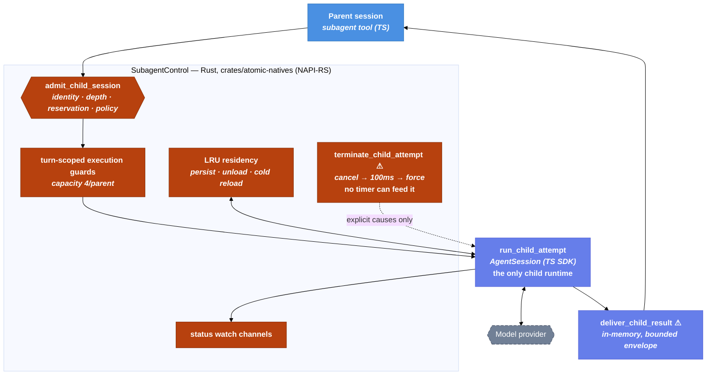

# In-Process Subagent Runner (Codex-Aligned, Rust Control Plane) — Technical Design Document / RFC

| Document Metadata      | Details                                                        |
| ---------------------- | -------------------------------------------------------------- |
| Author(s)              | Norin Lavaee                                                   |
| Status                 | Draft (WIP)                                                    |
| Team / Owner           | Atomic — subagents (`@bastani/subagents`) + natives (`crates/atomic-natives`) |
| Created / Last Updated | 2026-08-04                                                     |
| Tracking issue         | [bastani-inc/atomic#2188](https://github.com/bastani-inc/atomic/issues/2188); fixes [#2191](https://github.com/bastani-inc/atomic/issues/2191) (detach → live async widget) |
| Compatibility posture  | **Clean break. No backwards compatibility.** The process-child runtime, the detached async runner, the file-based result-delivery pipeline, the env-variable bridge, the watchdog and its knobs, and the exit-code conventions are deleted, not emulated. The `subagent` tool keeps its name and actions; its result contract and `async` semantics are redesigned. |
| Implementation language | Control plane in **Rust** (`crates/atomic-natives`, NAPI-RS), a structural port of codex-rs; session runtime stays TypeScript (`createAgentSession`). |

## 1. Executive Summary

Bundled subagents launch every child as an OS process (Atomic CLI in `--mode json -p`), while workflow stages already run children in-process on `createAgentSession`. The process path pays cold CLI startup per model attempt, bridges all policy through ~20 env vars and argv, and supervises children with a silence-based idle watchdog that kills productive runs: any 5-minute quiet stretch outside an in-flight tool — long provider thinking, a slow final generation — gets SIGTERM (exit 143) and discards the accumulated spend. During the research for this very spec, all three research subagents were idle-killed exactly once mid-work (`research/docs/2026-08-04-issue-2188-live-reproduction.md`).

This spec aligns Atomic's subagent runtime with **Codex's multi-agent architecture** (`codex-rs`), decision-for-decision (§4.5): zero OS processes — children are in-process `AgentSession`s and *nothing else*; one Rust control plane per parent session with RAII spawn reservations, turn-scoped execution guards, LRU residency with transparent cold reload, persistent child identities, watch-channel status, bounded terminal envelopes, a literal 100 ms interrupt grace, and **no kill-capable timers of any kind**. The control plane is implemented in Rust inside `crates/atomic-natives` — the same memory-safety posture as codex-rs itself — exposed to the TypeScript session runtime over NAPI-RS. Where Atomic deliberately keeps its own shape: per-agent tool allowlists, depth ≤ 5, model-fallback ladders, bounding *both* result branches, and the request/response tool surface instead of Codex's mailbox protocol. Everything that existed to serve processes — spawn machinery, env bridge, watchdog, exit codes, detached runner, PID reconciliation, file-claim result delivery — is deleted.

## 2. Context and Motivation

Cited research (all in this repository):

- `research/docs/2026-08-04-subagents-process-spawn-runtime.md` — full trace of the process-spawn runtime: spawn path, env bridge, watchdog semantics, result plumbing, and an inventory of behaviors that runtime imposed on the rest of the system.
- `research/docs/2026-08-04-workflows-inprocess-session-runtime.md` — the in-process stage runtime this design reuses (`createAgentSession`, steering/pause/abort, transcripts, `getSessionStats`).
- `research/web/2026-08-04-codex-inprocess-subagent-design.md` — Codex's in-process child-thread design (112 pinned citations): control plane, RAII reservations, residency/execution/depth bounds, status watch, bounded result envelope, no idle timer, no child wall-clock timeout, 100 ms interrupt grace.
- `research/docs/2026-08-04-issue-2188-live-reproduction.md` — this session's 3-for-3 idle-kill reproduction.

### 2.1 Current State

- **Workflow stages**: in-process `createAgentSession`, no idle watchdog, abort/pause via SDK methods, JSONL transcripts, `getSessionStats()` available.
- **Bundled subagents**: one CLI process per model attempt (foreground), or a detached jiti runner process that itself spawns one CLI process per step (background — two process hops). Supervision is byte-driven. Results from background runs travel through a file-watcher/claim/quarantine pipeline built entirely around the fact that the producer is another process that may outlive the consumer.

**Leaking doors (today) — all deleted by this spec:**

- The kill decision lives in a watchdog that cannot see whether the provider is still working. "No bytes for 300 000 ms" is read as "dead," but extended thinking and long final generations are exactly that. A lie that costs $2–$3 per false positive (issue metas: `21ddf57c`, `d5f89f0b`, `de7432c4`).
- Child capability policy is smeared across ~330 lines of argv construction and ~20 `ATOMIC_SUBAGENT_*` env keys. There is no door that admits a child; there is a pipeline that assembles a process.
- The watchdog's timeout message is pattern-matched by fallback classification (`/timed? out/i` → retryable), so a false idle kill silently restarts the attempt on the next candidate.
- The parent branches on a synthesized numeric protocol (`0/1/-1/-2/143`) encoding process facts, not domain outcomes.
- Result delivery needs claims, dedupe, quarantine, and stale-PID reconciliation — distributed-systems machinery for what is logically a function call.

### 2.2 The Problem

- **User impact:** long research children die mid-run after tens of turns, or "succeed" slowly (p50 ≈ 194 s for real ok runs; ~33 % error rate in the issue's history). Killed runs discard cache, context, and money.
- **Cost impact:** cold CLI/jiti/settings/model boot per child, multiplied by fan-out; a second full process hop for async runs.
- **Technical debt:** two runtimes; supervision, delivery, and liveness all built on process facts; usage/cost parsed second-hand from an event stream.

## 3. Goals and Non-Goals

### 3.1 Functional Goals

- [ ] **G1:** Every subagent child runs as an in-process `AgentSession`. **Zero OS processes** — the CLI-child spawn *and the detached async runner* are deleted (full Codex alignment).
- [ ] **G2:** No kill-capable timers anywhere. Children are bounded by execution guards, residency, depth, and provider request timeouts; they die only by explicit termination or their own completion.
- [ ] **G3:** A **Rust control plane** (`SubagentControl`, `crates/atomic-natives`) ports codex-rs structurally: identity registry, RAII spawn reservations, turn-scoped execution guards, LRU residency, status watch channels, cancellation with a literal 100 ms grace.
- [ ] **G4:** Children have **persistent canonical identities** (Codex task paths: `<parent>/analysis/task_3`): listable, cold-messageable, transparently reloaded from their session file through residency.
- [ ] **G5:** One admission door resolves each child's complete policy as typed objects; the env-variable bridge is deleted.
- [ ] **G6:** Results carry a typed `status` (`ok | error | skipped | interrupted | continued`) plus full `SessionStats` on every terminal outcome; the terminal envelope into parent context is token-bounded on **both** branches. Numeric exit codes are deleted.
- [ ] **G7:** `async: true` unifies onto the same runtime: it means *don't wait* — the call returns a child identity immediately and the jobs widget tracks it. Runs no longer survive parent exit (accepted; documented loudly).
- [ ] **G8:** Foreground intercom detach becomes the same background continuation mechanism (fixes #2191).
- [ ] **G9:** Every setting, parameter, env var, module, and pipeline that existed only to serve processes is removed (inventory in §10).

### 3.2 Non-Goals (Out of Scope)

- [ ] NOT building transitive-cost UI ([#1636](https://github.com/bastani-inc/atomic/issues/1636)); this spec only guarantees the data (G6) exists.
- [ ] NOT changing the workflow stage runtime or intercom protocol semantics.
- [ ] NOT keeping any process-isolation or process-fallback mode. Codex ships none.
- [ ] NOT adopting Codex's mailbox tool surface (`send_message`/`followup_task`/`wait_agent`); Atomic keeps request/response + intercom (decision record §9).
- [ ] NOT preserving parent-exit survival for async runs, any legacy result field, env var, or exit-code convention. No migration shims.
- [ ] NOT porting `AgentSession` itself to Rust; the SDK session runtime stays TypeScript. Rust owns control, not conversation.

## 4. Proposed Solution (High-Level Design)

### 4.1 System Architecture Diagram



### 4.2 Architectural Pattern

**Codex's `AgentControl`, ported to Rust, supervising TypeScript sessions.** One `SubagentControl` per root parent session — cloneable, holding a weak host reference so ownership cannot cycle — owns the child registry, canonical paths, RAII reservations, execution guards, residency state, status watches, and cancellation tokens. It is a structural port of `codex-rs/core/src/agent/*` into `crates/atomic-natives`, exposed over NAPI-RS. The TypeScript side owns what it already does well: `createAgentSession`, event streaming, artifacts, and the tool surface. Rust decides *whether and when* a child runs, lives, or dies; TypeScript executes the conversation.

### 4.3 Key Components

| Component | Lang | Responsibility | Codex analogue |
| --- | --- | --- | --- |
| `SubagentControl` | Rust | Per-root control plane: registry, paths, reservations, guards, residency, watches, cancellation | `AgentControl` (`agent/control.rs`) |
| `AgentRegistry` + `SpawnReservation` | Rust | Persistent child identities; RAII reserve → start → commit; drop releases | `registry.rs` |
| `ExecutionLimiter` | Rust | Turn-scoped guards, capacity 4 per parent; guard held by the running turn, released between turns | `agent/control/execution.rs` |
| `Residency` | Rust | LRU of loaded children; unload = persist session + dispose runtime; transparent cold reload on message | `agent/control/residency.rs` |
| `StatusWatch` | Rust | Watch channel per child, reduced from lifecycle events: `pending/running/ok/error/interrupted/continued` | `watch::channel(AgentStatus)` |
| `InProcessChildRunner` | TS | One `AgentSession` per model attempt; events → progress/artifacts; N-API callbacks feed the watch | `Session::spawn` (conversation half) |
| `BackgroundContinuation` | TS | `async`/detach unification: hand a live child to the jobs widget tracker | persisted-identity + completion-envelope model |
| Deletion set | — | Everything in §10 | Codex has no equivalents — that is the point |

### 4.4 The Door Set at a Glance (Stranger-Across-Time View)

> `delegate_subagent_run`, `admit_child_session`, `run_child_attempt`, `continue_in_background`, `reload_cold_child`, `terminate_child_attempt` ⚠, `deliver_child_result` ⚠.

Read alone: a parent delegates bounded work; every child passes one admission gate and receives a durable name; children run as sessions — there is no other way to run one; a child that outgrows its foreground call continues in the background under the same name; a finished child can be spoken to again and comes back cold from its transcript; exactly one door can kill and no clock feeds it; exactly one door delivers a bounded result. No door creates a process, because none exists.

### 4.5 Codex Correspondence (decision-for-decision)

Resolved with the requester on 2026-08-04 (decision record §9). Citations in `research/web/2026-08-04-codex-inprocess-subagent-design.md`.

| Codex mechanism | Codex source | Atomic decision | Divergence |
| --- | --- | --- | --- |
| Zero OS processes; children are in-process sessions on the shared runtime | `Session::spawn`, `thread_manager.rs` | **Aligned** — CLI-child spawn *and* detached async runner deleted; runs die with the host | none |
| One cloneable root-scoped control plane, weak manager ref | `agent/control.rs#L90-L109` | **Aligned** — `SubagentControl`, in Rust | none (language: Rust here too) |
| RAII spawn reservation: reserve → start → commit; drop releases | `registry.rs` | **Aligned** | none |
| Turn-scoped execution guards; capacity error to caller; slots free between turns | `agent/control/execution.rs` | **Aligned** — typed `CapacityExhausted` refusal; caller retries | none |
| LRU residency: persist rollout, unload terminal idle LRU child, transparent cold reload on message | `residency.rs`, `ensure_v2_agent_loaded` | **Aligned** | none |
| Persistent canonical child identities (task paths), listable, messageable cold, unbounded count | V2 `spawn_agent`/`list_agents` | **Aligned** — `<parent-path>/<task_name>_<n>`, backed by session files | none |
| No close tool; cleanup is LRU-only | V2 (deliberately dropped V1 `close_agent`) | **Aligned** — no close/dispose action | none |
| Interrupt: cooperative cancel → 100 ms grace → force abort → terminal `Interrupted`, child stays usable | `tasks/mod.rs` `GRACEFULL_INTERRUPTION_TIMEOUT_MS = 100` | **Aligned** — literal 100 ms, enforced in Rust; session flushed before force-finalize (Codex's materialize-before-shutdown order) | none |
| No idle timer, no child wall-clock timeout; deadlines bound waits, not lives | research §6 (explicit absence) | **Aligned** — no kill-capable timers; `TerminationCause` has no timer variant | none |
| Status watch channel reduced from lifecycle events | `protocol.rs`, `session/mod.rs` | **Aligned** — plus a `continued` variant for #2191 | variant added |
| Two channels: structured progress to UI; only a terminal envelope into parent model context | `SubAgentActivityItem` + `InterAgentCommunication(Result)` | **Aligned** | none |
| Bounded completion envelope | `session_prefix.rs` (error-only, 1000 tokens) | Adopted and **extended: both branches bounded**, overflow → `_output.md` pointer | stricter than Codex |
| Depth: V1 max 1; V2 unchecked | `config/mod.rs`, `spec_plan.rs` | **Kept Atomic:** depth ≤ 5, structural | deliberate |
| Children get the parent's tools (no per-child allowlist) | `multi_agents_spec.rs#L757-L768` | **Kept Atomic:** per-agent tool allowlists at admission | deliberate |
| No model fallback; children inherit parent's live model | `multi_agents_common.rs` | **Kept Atomic:** candidate ladder + auth pre-filter above the runner | deliberate |
| Mailbox protocol (`send_message`/`followup_task`/`wait_agent`/`interrupt_agent`/`list_agents`) | `multi_agents_v2/*` | **Not adopted:** request/response `subagent` tool + intercom; `status`/`interrupt`/`resume` actions cover control | deliberate |

## 5. Detailed Design

### 5.1 The Doors (Entrypoint Contracts)

```ts
// — Admission. Every child passes exactly here. Rust owns the gate. —

admit_child_session(
  spec: ChildSpec,                    // agent def + task_name + task + overrides
  parent: ParentContext,              // session id, path, depth, orchestration ctx, group
): Result<AdmittedChild, AdmissionRefusal>
// Guarantee: mints the child's persistent canonical identity (<parent-path>/<task>_<n>),
//   reserves its spawn slot and residency slot (RAII), and resolves its complete
//   capability policy as typed objects before any session exists.
// AdmissionRefusal = DepthExceeded(max 5) | CapacityExhausted | DispatchGuardBusy
//                  | InvalidCwd(reason) | UnknownAgent
// Codex spawn_agent_internal order: reserve → start → commit; every failure path
//   releases via Drop. Depth is carried inside AdmittedChild; no constructor accepts 6.
//   CapacityExhausted is a normal, retryable refusal (turn-scoped guards free slots
//   between turns) — the dispatcher retries; the model sees it only when truly saturated.

// — Execution. One runtime. TS conversation under Rust guards. —

run_child_attempt(
  admitted: AdmittedChild,            // ← only producible by admit_child_session
  candidate: ModelCandidate,          // one model+thinking attempt (fallback ladder outside)
  signals: { abort: AbortSignal; interrupt: AbortSignal },
): Promise<AttemptOutcome>
// Guarantee: acquires a turn-scoped execution guard, runs one model attempt on an
//   in-process AgentSession, publishes lifecycle to the child's StatusWatch, and
//   releases the guard at turn end (Codex: guard held by RunningTask, dropped with it).
// AttemptOutcome =
//   | Ok(output, stats)
//   | Error(cause, stats, fallbackSignal?)   // structured cause, not a message regex
//   | Interrupted(stats)                     // child remains usable (Codex: interrupted ≠ closed)
//   | Continued(childPath)                   // via continue_in_background
// stats: SessionStats from getSessionStats() on EVERY variant. No exit codes exist.

continue_in_background(
  running: RunningAttempt,
  reason: ContinuationReason,         // "async-requested" | "intercom-coordination"
): ChildPath
// Guarantee: settles the foreground call with Continued(path) while the child keeps
//   running under the same identity; the async jobs widget tracks it live.
// This is the WHOLE async surface now: `async: true` calls this immediately after
//   admission; intercom detach calls it mid-run (#2191). One mechanism, two reasons.
//   Runs do not survive parent exit — cold identities do (session files), and can be
//   reloaded next start via reload_cold_child.

reload_cold_child(
  path: ChildPath,                    // persistent identity; session file is the backing store
  message: string,
): Result<AdmittedChild, AdmissionRefusal>
// Guarantee: transparently re-loads an unloaded child from its persisted session under a
//   protected residency slot and delivers the message — Codex ensure_v2_agent_loaded.
// Called by the tool's resume action and by any message to a cold path; it funnels
//   through admission, so a reloaded child cannot bypass depth or capacity.

terminate_child_attempt(
  attempt: AttemptId,
  cause: TerminationCause,            // Abort | Interrupt | FailFastSkip | ParentShutdown
): Promise<void>
// Guarantee: cooperative cancel → 100 ms grace (Rust-enforced, Codex-literal) → force
//   abort; the session file is flushed BEFORE force-finalization (Codex materializes the
//   rollout before shutdown), then the outcome is stamped with the cause.
// ⚠ IRREVERSIBLE for the attempt — not the identity: interrupted children stay
//   addressable and reloadable. The single kill chokepoint; TerminationCause has no
//   WallClockCap and no IdleTimeout variant — the timer kill is unrepresentable.

// — Delivery. In-memory; the process-era claim pipeline is deleted. —

deliver_child_result(envelope: ResultEnvelope): Promise<void>
// Guarantee: delivers the terminal result to the parent exactly once, in-memory, and
//   persists the record (artifacts + history). The envelope is BOUNDED on both branches
//   (token budgets; overflow → pointer to _output.md). Only this envelope enters parent
//   model context — child token streams never do. ⚠ irreversible.
// File claims, dedupe, quarantine, and stale-PID repair are deleted: producer and
//   consumer share one process, so delivery is a function call, not a protocol.
```

**Per-door audit (rubric):**

| Door | (1) Joint | (2) One sentence | (3) Honest name | (5) Every exit | (6) Refusals real | (7) Trust transition | (8) One chokepoint |
| --- | --- | --- | --- | --- | --- | --- | --- |
| `admit_child_session` | ✅ admission | ✅ "mints identity, reserves slots, resolves policy" | ✅ | RAII drop on every failure | depth/capacity in constructor | parent ctx → child policy, only here | ✅ sole admission |
| `run_child_attempt` | ✅ one attempt | ✅ | ✅ | every variant carries stats; guard released on all paths | needs `AdmittedChild` | n/a | sole child runtime |
| `continue_in_background` | ✅ continuation | ✅ "settles foreground, child continues under its name" | ✅ (not `-2`, not a fake `async` fork) | tracker failure → stays foreground with error | needs `RunningAttempt` | supervisor changes once | ✅ sole background path |
| `reload_cold_child` | ✅ resumption is the joint | ✅ "reloads from transcript under a protected slot" | ✅ says *cold* | invalid path/file → typed refusal | funnels through admission | trusted-root validation at the door | ✅ sole cold-load path |
| `terminate_child_attempt` ⚠ | ✅ | ✅ "cancel, grace, force, stamp cause" | ✅ | double-call idempotent; flush-before-force | timer causes unrepresentable | n/a | ✅ all kills converge |
| `deliver_child_result` ⚠ | ✅ | ✅ "bounded envelope to parent, once" | ✅ | persistence failure surfaces, delivery doesn't replay | bounded by type | n/a | ✅ sole delivery |

### 5.2 Phase 1 — Disarm the Idle Kill (interim, tiny)

While the runner work proceeds, stop the bleeding on the legacy path with the smallest honest change: delete the idle trip (timer + `isToolActive` deferral). The wall cap remains temporarily as the legacy path's only bound and dies with the path. No new activity heuristics — dead code within two phases.

### 5.3 Phase 2 — Rust Control Plane + In-Process Foreground Runner

- **Rust crate:** `subagent-control` module in `crates/atomic-natives`, NAPI-RS surface mirroring §4.3. State is `Arc`-shared per parent session exactly as codex-rs shares `AgentControl`; TS holds an opaque handle. Cancellation tokens, the 100 ms grace timer, guard accounting, residency LRU, and the identity registry live entirely in Rust — memory-safe, data-race-free by construction, unit-testable with `cargo test` without a JS host.
- **Session construction (TS):** `InProcessChildRunner` builds `CreateAgentSessionOptions` from the resolved `ChildPolicy`: validated `cwd`, per-candidate `model`+`thinkingLevel`, per-agent `tools`/`excludedTools`, `customTools` for structured output, a `DefaultResourceLoader` for context/skills/system prompt as strings, and a `SessionManager` whose JSONL file doubles as the child's persistent identity backing store. Sessions are marked internal with run metadata.
- **Event flow:** `session.subscribe()` feeds progress, artifacts (`.jsonl` mirror, 50 MB cap), the mutating-failure guard, and — via N-API callback — the Rust `StatusWatch`. Usage/cost from `getSessionStats()`.
- **No timers:** no idle trip, no wall cap. Bounds are guards, residency, depth, provider timeouts. Advisory long-running notices (time/turn/token) remain the human safety valve; they cannot kill.
- **Capacity (Codex turn-scoped):** guards are acquired per turn-starting operation and released when the turn ends; an idle or backgrounded child holds no execution slot (its residency slot is separate, LRU-managed). Saturation surfaces as typed `CapacityExhausted`; the parallel dispatcher retries with backoff before the model ever sees it.
- **Residency:** loaded children are LRU-tracked; unloading requires terminal status + no active turn + no pending delivery, persists the session, disposes the runtime. Any message to a cold path goes through `reload_cold_child`. No close action exists (Codex V2).
- **Async unification (breaking):** `async: true` = admit, `continue_in_background("async-requested")`, return the child path immediately. Same mechanism as intercom detach (#2191). The jobs widget tracks all background children. **Runs die with the parent process**; cold identities survive as session files and can be reloaded next start. The launch message, docs, and changelog state this loudly.
- **Typed outcomes end-to-end:** statuses replace exit codes in results, artifacts, history, and fail-fast (`skipped`, not `-1`). Fallback classification consumes structured causes.
- **Deletions in this phase:** foreground CLI-child spawn machinery, `pi-args.ts`, `pi-spawn.ts`, `spawn-env.ts`, `attempt-watchdog.ts`, the env bridge, exit-code synthesis, kill escalation ladders.

### 5.4 Phase 3 — Delete the Async Runner and the File-Delivery Pipeline

`async-execution-*.ts`, `subagent-runner*.ts`, the jiti runner spawn, `SIGUSR2`/`SIGBREAK` signaling, PID tracking, `stale-run-reconciler.ts`, `result-watcher.ts`, `result-file-claims.ts`, `completion-claims.ts`, `result-quarantine.ts`, and `result-status.ts` are deleted. `status.json`/`events.jsonl` are replaced by the `StatusWatch` + registry (the `status` action reads Rust state; the widget subscribes). Async runs from prior versions are not migrated.

### 5.5 Data Model / Schema

| Field | Type | Notes |
| --- | --- | --- |
| `path` | `string` | persistent canonical identity, e.g. `session-a1/analysis_1` |
| `status` | `"ok" \| "error" \| "skipped" \| "interrupted" \| "continued"` | the only outcome discriminator |
| `cause` | `string?` | structured cause when `status` ≠ `ok` |
| `stats` | `SessionStats` | tokens, cost, turns, tool calls — every terminal status |
| `envelope` | `string` | token-bounded on both branches; overflow points to `_output.md` |
| `model`, `modelAttempts` | existing shapes | fallback ladder reporting, typed causes inside |
| `sessionFile`, `artifactsDir`, `durationMs`, `timestamp` | existing shapes | `sessionFile` is the identity's backing store |

`run-history.jsonl` records `status`. Artifact naming (`_input.md`, `_output.md`, `.jsonl`, `_meta.json`) is kept — it serves users.

### 5.6 State Management

Child identity lifecycle (Rust-owned): `reserved → loaded → (running ↔ idle) → terminal(status) → unloaded ⇄ reloaded`. Attempt lifecycle: `running → (ok | error | interrupted | continued)`, `skipped` only pre-run. Unload requires terminal + no active turn + no pending delivery (Codex `is_unloadable`). No transition is timer-driven. The registry and watches die with the host process; session files are the durable layer.

## 6. Alternatives Considered

| Option | Pros | Cons | Reason for Rejection |
| --- | --- | --- | --- |
| A: Tune timeouts only | Trivial | Any threshold both kills slow thinkers and waits on real hangs | The door named *timeout* still means *quiet-detector* |
| B: Streaming-aware watchdog on the process path | Fixes false kills cheaply | Preserves the process runtime and its whole bridge forever | Don't instrument the dying path; delete it |
| C: In-process default + process opt-out | Gentler rollout | Every legacy knob survives "temporarily," meaning forever | Rejected by requester: no backwards compatibility |
| D: Keep the detached runner for async survival | Async runs outlive the parent | One process path keeps alive PID reconciliation + the entire file-claim delivery pipeline | Rejected by requester: full Codex, zero processes; survival traded for cold-identity reload |
| E: TS control plane | No FFI boundary | Loses Rust's data-race-free guard/registry/cancellation guarantees; diverges from codex-rs implementation posture | Rejected by requester: Rust in atomic-natives |
| F: **Full Codex alignment, Rust control plane (Selected)** | One runtime, zero processes, memory-safe supervision, false-kill class structurally gone | Parent exit ends live runs; largest migration | **Selected** |

## 7. Cross-Cutting Concerns

### 7.1 Security and Privacy

- **Policy as types at one door.** Tool allowlists, MCP selection, skills, structured-output schemas, group resolve inside `admit_child_session` as objects. The env carrier and its scrub-last defense are deleted with the risk they defended against.
- **Children share the parent's OS privileges** — uniformly true now, as for stages. No isolation mode exists to misconfigure.
- **Supervisor capability tokens** live in `AdmittedChild`, never in inheritable env; descendants structurally cannot receive a parent's grant.
- **Cold reload is the sensitive door:** `reload_cold_child` turns a file into a running child. It keeps the trusted-root/`.jsonl`/existence validation and funnels through admission.
- **Rust boundary:** the control plane takes no untrusted input except through typed NAPI structs; no shell, no env, no paths from the model without validation on the TS side first.

### 7.2 Performance

- Zero process boots anywhere; #2070's startup class disappears entirely.
- Turn-scoped guards mean idle/background children cost no execution capacity; N-wide fan-out bounded at 4 running turns per parent.
- Rust registry/guards/watches: supervision overhead is nanoseconds, not file I/O; `status` reads no files.

### 7.3 Observability

- `path` + `status` + `cause` + `stats` make every child auditable; the watch gives the widget live state without polling.
- After rollout, #2188's error-rate table can be recomputed with real causes instead of exit-code archaeology.

## 8. Test Plan

- **Rust unit (`cargo test`, no JS host):** reservation RAII under every failure interleaving; turn-guard acquire/release property tests; residency: unload only terminal+idle+delivered, LRU order, protected-slot reload; watch reduction from event sequences; 100 ms grace timing; `TerminationCause` exhaustiveness — no timer variant exists.
- **NAPI integration:** TS session events drive the watch; cancellation token → TS abort signal → flush-before-force order verified (session file valid JSONL after force-abort).
- **TS unit — refusals:** `AdmittedChild` at depth 6 unconstructible; cold reload of an invalid/untrusted path refused; `continue_in_background` rejects non-running attempts.
- **Integration — runner parity:** existing foreground suites (single/parallel/chain, fail-fast, interrupt, structured output, model fallback, artifacts, history) rewritten against typed statuses; `ps` probe asserts **zero** child processes in all modes, including `async: true`.
- **Integration — async/detach unification (#2191):** `async: true` returns a path immediately and the widget tracks it; an intercom detach mid-run produces the same tracked continuation; each delivers exactly one bounded terminal envelope.
- **Integration — cold reload:** finish a child, evict it under residency pressure, message its path — it reloads from its session with context intact; reload of a depth-5 child under a saturated parent is refused, not wedged.
- **Deletion tests:** CI greps that §10's env keys, modules, and the claim-pipeline files stay deleted.
- **Interactive verification (runnable checklist):**
  1. `codebase-analyzer` on a task requiring > 5 min of uninterrupted thinking — completes, `status: "ok"`, `stats` present, no kill. (The scenario that died three times during this spec's research.)
  2. Parallel 3-agent fan-out — ≤ 4 running turns, zero child processes in `ps`, three metas with `status` and `path`.
  3. `subagent({action:"interrupt"})` mid-run — child yields `interrupted` within ~100 ms + teardown, session file intact, then `resume` (cold reload) continues it with context.
  4. Foreground child contacts its supervisor — jobs widget live view, single completion notice, result `continued` then terminal.
  5. `async: true` run; exit the parent; restart — the run is gone (documented), its path listed cold, `resume` reloads it from the session file.
  6. Set `ATOMIC_SUBAGENT_ATTEMPT_IDLE_TIMEOUT_MS=1000` on a long child — no effect; the variable no longer exists.

## 9. Decision Record (resolved with the requester, 2026-08-04)

| # | Decision | Alignment |
| --- | --- | --- |
| 1 | **Zero OS processes** — delete the detached async runner too; survival traded for cold-identity reload | Codex |
| 2 | Depth ≤ 5 kept | Atomic |
| 3 | **Turn-scoped execution guards** + typed `CapacityExhausted`; slots free between turns | Codex |
| 4 | **LRU residency + transparent cold reload** | Codex |
| 5 | Bounded envelope on **both** branches | Stricter than Codex |
| 6 | Per-agent tool allowlists kept | Atomic |
| 7 | Request/response tool + intercom; no mailbox protocol | Atomic |
| 8 | Model-fallback ladder kept | Atomic |
| 9 | **Persistent canonical child identities** (task paths, listable, cold-messageable) | Codex |
| 10 | **`async` unified**: don't-wait on the same runtime; no parent-exit survival | Codex (consequence of 1) |
| 11 | **No close action**; LRU-only cleanup | Codex V2 |
| 12 | **Literal 100 ms interrupt grace**, flush-before-force; control plane implemented in **Rust** (`crates/atomic-natives`, NAPI-RS) | Codex, including implementation posture |

## 10. Clean-Break Inventory (Deleted, Not Deprecated)

**Env vars removed** (CI-guarded against reappearance): `ATOMIC_SUBAGENT_ATTEMPT_IDLE_TIMEOUT_MS`, `ATOMIC_SUBAGENT_ATTEMPT_TIMEOUT_MS`, `ATOMIC_SUBAGENT_ATTEMPT_KILL_GRACE_MS`, `ATOMIC_SUBAGENT_CHILD`, `ATOMIC_SUBAGENT_FANOUT_CHILD`, `ATOMIC_SUBAGENT_DEPTH`/`_MAX_DEPTH`, all `ATOMIC_SUBAGENT_PARENT_*` nested-routing keys, `ATOMIC_SUBAGENT_INHERIT_*`, `ATOMIC_SUBAGENT_INTERCOM_SESSION_NAME`, `ATOMIC_SUBAGENT_ORCHESTRATOR_TARGET`, `ATOMIC_SUBAGENT_SUPERVISOR_*`, `ATOMIC_SUBAGENT_RUN_ID`/`_CHILD_AGENT`/`_CHILD_INDEX`, `MCP_DIRECT_TOOLS` (incl. `__none__`), structured-output capture/schema path vars, the fast-mode bridge var. (`ATOMIC_INTERCOM_GROUP` remains an intercom-package concern; subagents stop writing it.)

**Processes and pipelines removed:** the CLI-child spawn; the detached jiti async runner and its `SIGUSR2`/`SIGBREAK` signaling; PID liveness + `stale-run-reconciler.ts`; the entire file-based result-delivery pipeline (`result-watcher.ts`, `result-file-claims.ts`, `completion-claims.ts`, `result-quarantine.ts`, `result-status.ts`); `status.json`/`events.jsonl` (replaced by the Rust watch + registry).

**Protocols and conventions removed:** synthesized exit codes (`0/1/-1/-2/143`) → typed `status`; timeout-regex fallback classification → structured causes; the `--mode json -p` CLI-child contract; argv task spillover and 0600 prompt temp files; stdout-byte activity; SIGTERM/SIGKILL ladders; the static `Detached:` result; `async: true` as parent-exit survival.

**Modules removed** (~50 files; `runs/background/` is deleted nearly whole):

- `runs/shared/`: `attempt-watchdog.ts`, `pi-args.ts`, `pi-spawn.ts`, `spawn-env.ts`, `final-drain.ts` (stdout drain grace), `nested-events*.ts` + `nested-path.ts` + `nested-render.ts` (file/env-based nested-fanout event routing — event sinks, control inboxes, capability-token env; in-process nesting flows through the control plane in memory), `subagent-prompt-runtime.ts` (the extension injected into child CLIs via `--extension`; its prompt behavior becomes plain session construction).
- `runs/background/`: `subagent-runner*.ts` (the runner, 12 files), `async-execution-*.ts`, `async-event-journal.ts`, `async-resume.ts`, `async-status.ts`, `top-level-async.ts`, `result-*.ts` (watcher, claims, quarantine, status, retry scheduler, delivery processor), `completion-claims.ts`, `completion-dedupe.ts`, `stale-run-reconciler.ts`, `run-status.ts`, `run-id-resolver.ts`, `parallel-groups.ts`. `async-job-tracker.ts` is rewritten watch-backed (widget subscription, no polling, no PID); `completion-notification.ts` survives simplified (notices without claims).
- `runs/foreground/`: spawn/stream/kill machinery in `execution-attempt*.ts`; the entire `-2` detach apparatus — `execution-detach-reservations.ts`, `execution-detach-route.ts`, `execution-intercom-detach.ts`, `detached-cleanup-barrier.ts` — replaced by `continue_in_background`; `subagent-executor-async.ts` collapses to a thin don't-wait call; the revive machinery in `subagent-executor-resume.ts` collapses into `reload_cold_child`; jiti CLI-resolution probes.

**Kept because users touch them:** the `subagent` tool name and actions (`status`/`interrupt`/`resume`/`list`/…, now backed by the registry and cold reload); artifact file naming; `run-history.jsonl` (with `status`); worktree contracts; depth ≤ 5; parallel caps (50 tasks, 4 running turns); intercom child identity scheme; per-agent definitions, skills, and allowlists.
