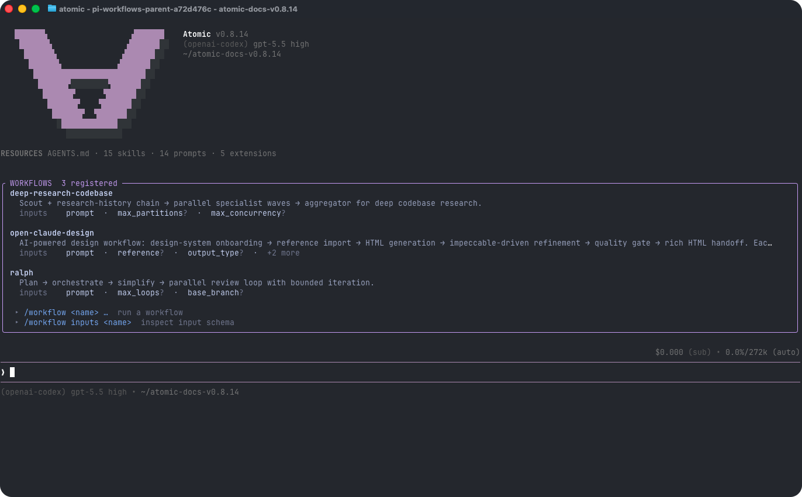

# Quickstart

This page gets you from install to a useful first Orphus session. Orphus is the loop engine for all engineering work: it runs reliable coding-agent loops with stages, tools, artifacts, verification, subagents, review gates, checkpoints, and human approvals.

## Prerequisites

- **A supported platform** — the release binaries cover macOS arm64 (Apple silicon) and Linux x64 (glibc 2.27+). Nothing else is required to run them; Node and Bun matter only when building from a clone.
- **Model-provider access** — Use `/login` after startup. Supports provider subscriptions and APIs.

## Install

Orphus is not published to npm. The release installer detects your platform, downloads
the newest GitHub Release archive, verifies its checksum, and links `orphus` into
`~/.local/bin`:

```bash
curl -fsSL https://raw.githubusercontent.com/kelvincushman/orphus/main/install.sh | sh
```

`install.sh --help` documents pinning an exact release (`--ref v2.0.0`) and the
`ORPHUS_INSTALL_DIR` / `ORPHUS_BIN_DIR` overrides. Later upgrades are `orphus update`,
which follows your channel: a stable install only moves to newer stable releases, a
prerelease install tracks the newest release of any kind.

To run from a clone instead — required on platforms without a release archive — build
the binary with Node ≥ 22.13, Bun 1.3.14, and a Rust toolchain; see
[the repository README](https://github.com/kelvincushman/orphus#tier-2--use-orphus-as-your-agent).

### Platforms without an archive

macOS arm64 and Linux x64 (glibc) are the built platforms. Windows, Linux arm64, and
musl (Alpine) archives are not built yet — the installer refuses politely rather than
guessing — so on those platforms run from a clone, or open an issue.

Then start Orphus in the project directory you want it to work on:

```bash
cd /path/to/project
orphus
```

## Uninstall

Remove the installed versions and the launcher link:

```bash
rm -rf ~/.local/share/orphus     # or your ORPHUS_INSTALL_DIR
rm -f ~/.local/bin/orphus        # or the link in your ORPHUS_BIN_DIR
```

This removes the CLI only. User configuration, auth, sessions, and packages remain under `~/.orphus/agent/` unless you delete that directory yourself.

## Authenticate

Orphus can use subscription providers through `/login`, or API-key providers through environment variables or the auth file.

### Option 1: subscription login

Start Orphus and run:

```text
/login
```

Then select a provider. Built-in subscription logins include Claude Pro/Max, ChatGPT Plus/Pro (Codex), and GitHub Copilot.

### Option 2: API key

Set an API key before launching Orphus:

```bash
export ANTHROPIC_API_KEY=sk-ant-...
orphus
```

You can also run `/login` and select an API-key provider to store the key in `~/.orphus/agent/auth.json`.

See [Providers](/providers) for all supported providers, environment variables, and cloud-provider setup.

## First session

On a fresh install with no prior Orphus startup state, Orphus shows a one-time first-run explanation after any What's New notes and directly above the input box describing Orphus as a verifiable coding agent runtime for building and running agent workflows you can feel confident in. Returning users with prior startup state are marked onboarded automatically and continue directly into the normal chat UI; stored credentials by themselves do not skip the first-run explanation. The composer is the normal Orphus input from the start: type a message, run `/login` first if no provider is connected, open `/orphus`, or launch a workflow command without a special onboarding transition.

Once Orphus starts, default to Goal for substantial verifiable build/change/fix/refactor work. Implementation, build, debugging, bug fixes, migrations, features, scoped multi-file edits, validation/review work, and loop-shaped requests should use Goal unless another workflow graph fits the domain better. Reserve direct chat for tiny deterministic read-only checks, handoff tasks, low-risk answers, or edits where tracking clearly adds more overhead than value.

Goal-first is not builtin-only or monolithic. Orphus can discover and run named builtin, project, user, and package workflows; author a rich custom TypeScript `workflow({...})` inline; and compositionally import reusable workflow definitions—including builtins from `@orphus/workflows/builtin`—into parent workflows with `ctx.workflow(...)`. Nested children can nest again within `maxDepth`, so custom graphs can combine proven research, implementation, design, verification, and approval workflows instead of copying them. They can also classify and branch, dynamically fan out and synthesize artifacts, run adversarial repair cycles, tournament-rank candidates, and loop until checks pass with explicit bounds.

Goal turns substantial engineering loops into executable stages with inspectable evidence instead of relying on a markdown checklist the model may or may not follow. It is native runtime behavior, not an optional skill. It freezes a plan before implementation, asks for 3..24 leaves, runs up to 10 ready leaves concurrently, verifies every leaf with exact per-check evidence, then requires final reviewer quorum. It reduces false completion but still reports unavailable tools, providers, unsafe checks, and external blockers honestly as `needs_human` instead of promising literal infallibility.

For an interactive tour any time, run `/orphus` inside the TUI; `/orphus overview`, `/orphus workflows`, and `/orphus example` walk through the same flow in more depth.

### Try the built-in workflows

Orphus ships with nine workflows you can run immediately. Use `/workflow list` to see them and `/workflow inputs <name>` to inspect their inputs in your environment.

| Workflow | When to use | Example |
|---|---|---|
| `classify-and-act` | Route requests through structured classification and low-confidence human fallback. | `/workflow classify-and-act prompt="Triage and handle this request"` |
| `fan-out-and-synthesize` | Partition independent slices, including repository-focused research, and synthesize their artifact evidence. | `/workflow fan-out-and-synthesize prompt="Map payment retries by subsystem and synthesize cited findings"` |
| `adversarial-verification` | Challenge a candidate with fresh verifiers and bounded repair. | `/workflow adversarial-verification task="Verify the migration patch"` |
| `generate-and-filter` | Generate, dedupe, filter, optionally judge, and shortlist candidates. | `/workflow generate-and-filter prompt="Propose names for the new command"` |
| `tournament` | Compare whole solutions through balanced pairwise judging. | `/workflow tournament prompt="Design the retry strategy"` |
| `loop-until-done` | Iterate with a durable ledger until completion or bound exhaustion. | `/workflow loop-until-done prompt="Repair failures until the test suite passes"` |
| `goal` | Default core route for substantial coding work: frozen plan, rolling 3..24-leaf team, per-check verification, and reviewer-gated completion. | `/workflow goal objective="Update the CLI docs, add one example, and validate the docs build"` |
| `ralph` | Research-first autonomous work with prompt refinement, delegated implementation, and iterative multi-model review. | `/workflow ralph prompt="Implement specs/rate-limit.md and validate burst traffic"` |
| `open-claude-design` | UI and design-system work with separate generate and feedback chains and a live `preview.html`. | `/workflow open-claude-design prompt="Refresh the settings page hierarchy as a page"` |

<p align="center"></p>

Inputs are bare `key=value` tokens. Values are JSON-parsed when possible, so `count=5`, `flag=true`, and `prompt="multi word value"` preserve useful types. If you call `/workflow <name>` without required inputs, the TUI opens an inline picker; pass `--no-picker` to skip it. Goal exposes `min_team_size=3`, `max_team_size=24`, and `max_parallel_agents=10` defaults for native team planning, returns plan/report artifact paths, and Goal and Ralph both support `git_worktree_dir` only when you explicitly want a reusable worktree. PR creation is skipped unless you set `create_pr=true` for the post-approval final stage.

You can also launch workflows with **natural language** — describe the task in chat and ask Orphus to run a matching installed workflow or author a task-specific one:

```text
Fan out repository research by subsystem, save cited findings as artifacts, and synthesize the evidence.
```

```text
Create a worker → fresh verifier → reducer workflow that updates the CLI docs, runs the docs build, and repairs evidence-backed findings until it passes or reaches a bounded stop.
```

```text
Use goal to update the CLI docs, include one example, run the docs build, and finish only when reviewers approve the evidence.
```

```text
Use ralph to research and implement specs/rate-limit.md, then review and repair it within three loops.
```

Orphus chooses a complete execution shape, fills inputs from the request, and confirms before launch. Use Goal as the normal core path for substantial verifiable coding work. Use Ralph when the job benefits from a research-first implementation/review loop. For exact domain contracts that either builtin does not cover, author a custom graph with deterministic checks and bounded repairs.

### Monitor and steer a run

Named workflow runs execute in the background. After launch you get the full run id; user-facing workflow surfaces show that complete UUID. You can still type the full id or a unique short prefix to inspect, connect, pause, quit, or resume a run. Ambiguous prefixes are reported rather than selecting a run arbitrarily.

```text
/workflow status <run-id>         # inspect one run's progress
/workflow status                  # list this session's active and terminal runs
/workflow connect <run-id>        # see agents working; chat with or steer each stage (F2 also opens latest)
/workflow attach <run-id> <stage> # chat with one stage
/workflow interrupt <run-id>      # pause resumably
/workflow resume <run-id> "go"    # send a steer message and resume
/workflow quit <run-id>           # pause gracefully and keep the run resumable
```

The below-editor `BACKGROUND` panel uses two lines per card at 80 columns and wider: the status glyph and full id are on the first line, and the workflow name plus mode/progress/elapsed metadata are on the second. Below 80 columns it collapses to a count-only line. In chat surfaces, a full id wraps onto continuation lines at narrow widths instead of being cut, and the surrounding border remains intact.

Human-in-the-loop prompts (`ctx.ui.input`, `confirm`, `select`, `editor`) surface in the graph viewer, not as chat modals — connect to the run to answer them.

Orphus also posts main-chat lifecycle notices when a run completes, fails, or awaits input. If you answer a workflow prompt in the graph or attached stage chat, the main chat receives a display-only answer summary for audit; it does not wake the model, enter LLM context, or answer later prompts. See [Workflows](/workflows) for the full reference and authoring guide.

### Top skills to invoke directly

Skills are reusable expert instructions. Trigger one with `/skill:<name>` followed by a request:

| Skill | When to use | Example |
|---|---|---|
| `research-codebase` | Scoped research that writes a grounded artifact for one subsystem or question. | `/skill:research-codebase how the rate limiter works in src/middleware/` |
| `create-spec` | Turn research into an implementation-ready plan. | `/skill:create-spec from research/docs/2026-03-rate-limit.md` |
| `prompt-engineer` | Create, optimize, evaluate, or troubleshoot prompts for GPT-5.6, Claude Opus 5, and Claude Fable 5. | `/skill:prompt-engineer Draft a sharper repo-research prompt for payment retries end to end.` |
| `tdd` | Test-first feature or bug work. | `/skill:tdd` |
| `impeccable` | Critique or refine web/native frontend and product UI; includes detector hooks. | `/skill:impeccable` |
| `playwright-cli` | Drive a real browser for end-to-end UI checks, screenshots, and reviewable proof videos. | `/skill:playwright-cli` |
| `liteparse` | Pull text, tables, or values out of PDF, DOCX, PPTX, XLSX, and image files locally. | `/skill:liteparse` |

Use `/skill:research-codebase` for a focused subsystem or question. For repository-wide research, use `fan-out-and-synthesize` with distinct repository partitions and an artifact synthesis barrier. Use Goal for ledger-backed bounded orchestration and Ralph for research-first delegated implementation with iterative review; task size alone does not select either workflow.

### Create your own workflow in natural language

Named workflows may be builtin, project, user, or package supplied. You do not have to hand-write TypeScript to add a new workflow. Describe what you want in plain chat and Orphus will design and write it for you using the [Workflows](/workflows) reference as the source of truth:

```text
Create a reusable Orphus workflow called review-changes. It takes one
required text input `target` (a diff, PR, or review focus). Run two reviewers
in parallel with fresh context — one for correctness and missing tests, one
for edge cases and maintainability — then a synthesis stage that
consolidates findings into blockers vs. suggestions and returns
{ consolidated_review, decision }.
```

Orphus will:

- ask clarifying questions if stage purpose, inputs, models, or handoffs are ambiguous,
- write a `.orphus/workflows/<name>.ts` definition that uses `workflow({ ... })` and imports `Type` from `typebox`,
- run `/workflow reload` so the generated workflow is rediscovered and can be launched with `/workflow <name>`,
- then report the generated workflow folder so you can inspect the code it wrote, using `Custom workflow created. You can inspect its code at: <workflow-folder-path>` (for example, `.orphus/workflows/`); Orphus does this only for newly created custom workflows, never builtin or pre-existing workflows.

The same plain-chat approach works for editing or hardening an existing workflow. For the full authoring reference, see [Workflows](/workflows), including composition with user-defined workflows and all nine builtins from `@orphus/workflows/builtin`.

### Default tools and prompts

If you'd rather start with a plain prompt, just type a request and press Enter:

```text
Summarize this repository and tell me how to run its checks.
```

By default, Orphus gives the model these tools:

- `read` - read files
- `bash` - run shell commands
- `edit` - patch files
- `write` - create or overwrite files
- `find` - discover files by glob pattern
- `search` - search file contents
- `ask_user_question` - ask structured questions in the TUI
- `todo` - manage file-based todos

Normal coding sessions include file discovery and content search through `find` and `search` in addition to `read`, `bash`, `edit`, and `write`. Orphus runs in your current working directory and can modify files there. Use git or another checkpointing workflow if you want easy rollback.

## Give Orphus project instructions

Orphus loads context files at startup. Add an `AGENTS.md` file to tell it how to work in a project:

```markdown
# Project Instructions

- Run `bun run typecheck` after code changes.
- Do not run production migrations locally.
- Keep responses concise.
```

Orphus loads:

- `~/.orphus/agent/AGENTS.md` for global instructions
- `AGENTS.md` or `CLAUDE.md` from parent directories and the current directory

Restart Orphus, or run `/reload`, after changing context files.

## Common things to try

### Reference files

Type `@` in any interactive editor to fuzzy-search files; or pass files on the command line:

```bash
orphus @README.md "Summarize this"
orphus @src/app.ts @src/app.test.ts "Review these together"
```

Images can be pasted with CTRL+V (ALT+V on Windows) or dragged into supported terminals.

### Run shell commands

In interactive mode:

```text
!bun run lint
```

The command output is sent to the model. Use `!!command` to run a command without adding its output to the model context.

### Switch models

Use `/model` or CTRL+L to choose a model. Use SHIFT+Tab to cycle thinking level. Use CTRL+P / SHIFT+CTRL+P to cycle through scoped models.

### Continue later

Sessions are saved automatically:

```bash
orphus -c                  # Continue most recent session
orphus -r                  # Browse previous sessions
orphus --name "my task"    # Set session display name at startup
orphus --session <path|id> # Open a specific session
```

Inside Orphus, use `/resume`, `/new`, `/tree`, `/fork`, and `/clone` to manage sessions.

### Non-interactive mode

For one-shot prompts:

```bash
orphus -p "Summarize this codebase"
cat README.md | orphus -p "Summarize this text"
orphus -p @screenshot.png "What's in this image?"
```

Use `--mode json` for JSON event output or `--mode rpc` for process integration.

## Next steps

- [Using Orphus](/usage) - interactive mode, slash commands, sessions, context files, and CLI reference.
- [Workflows](/workflows) - run, inspect, and author multi-stage automation (including the built-in workflows).
- [Skills](/skills) - reusable expert instructions invoked with `/skill:<name>`.
- [Providers](/providers) - authentication and model setup.
- [Settings](/settings) - global and project configuration.
- [Keybindings](/keybindings) - shortcuts and customization.
- [Orphus Packages](/packages) - install shared extensions, skills, prompts, and themes.

Platform notes: [Windows](/windows), [Termux](/termux), [tmux](/tmux), [Terminal setup](/terminal-setup), [Shell aliases](/shell-aliases).
